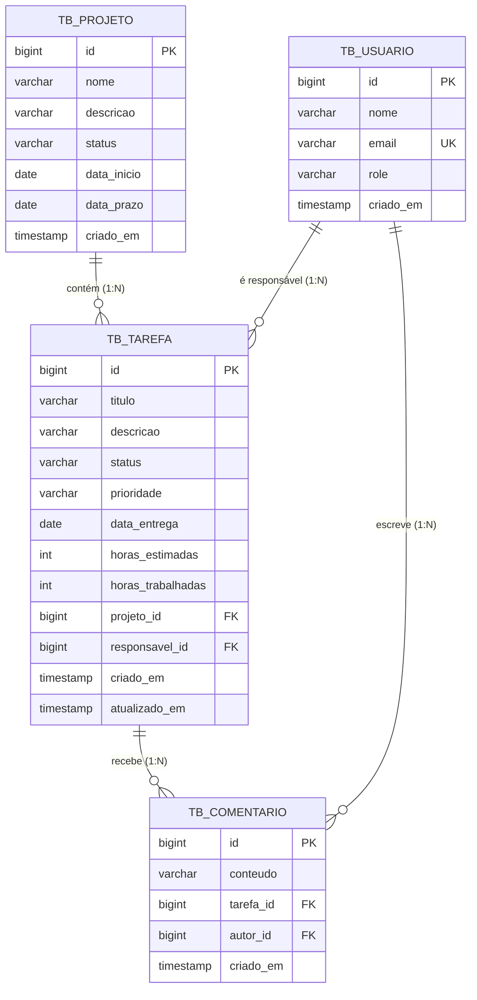
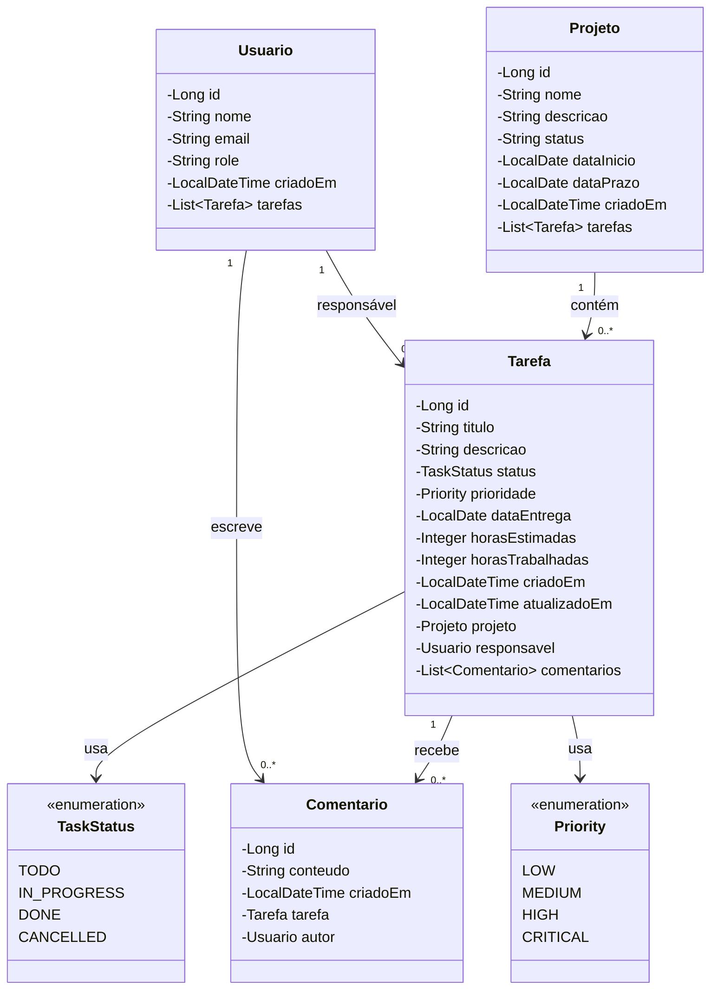

# 📋 TaskFlow API

> Sistema de Gerenciamento de Projetos e Tarefas — REST API desenvolvida com Java 21 + Spring Boot 3

---

## 👥 Integrantes do Grupo

| Nome |
|------|-----------|
| [Alice Flávia Félix Lucena] |
| [Jady Wéllyda de Albuquerque Silva] |
| [João Vitor Lemos de Souza] |
| [João Vitor Lemos de Souza] |
| [Luis Henrique dos Anjos Silva] |
| [Vívian Gabryelle Gomes Lucena Silva] |

**Disciplina:** Programação II  
**Instituição:** Centro Universitário FACOL  
**Semestre:** 2025.1

---

## 📌 O Problema

Equipes de desenvolvimento e gestão de projetos frequentemente sofrem com a **falta de visibilidade** sobre o andamento das tarefas: não sabem quem está sobrecarregado, quais entregas estão atrasadas, quais tarefas críticas ainda não têm responsável e qual o percentual de conclusão de cada projeto.

Planilhas e comunicação informal por mensagem não oferecem rastreabilidade, nem alertas automáticos de risco.

## 💡 A Solução

O **TaskFlow** é uma API RESTful que centraliza o gerenciamento de projetos e tarefas, permitindo:

- Cadastrar projetos com prazos e membros de equipe
- Criar e atribuir tarefas com prioridade, estimativa de horas e status
- Comentar nas tarefas para registro de decisões
- Consultar relatórios analíticos: carga da equipe, atrasos, desvios de estimativa e progresso por projeto

---

## 🛠️ Tecnologias Utilizadas

| Tecnologia | Versão | Função |
|------------|--------|--------|
| Java | 21 (LTS) | Linguagem principal |
| Spring Boot | 3.2.5 | Framework da aplicação |
| Spring Web | 6.x | Camada REST (Controllers) |
| Spring Data JPA | 3.x | Acesso ao banco de dados |
| Hibernate | 6.x | ORM (mapeamento objeto-relacional) |
| H2 Database | 2.x | Banco de dados em memória (testes) |
| Bean Validation | 3.x | Validação dos DTOs (`@Valid`) |
| Springdoc OpenAPI | 2.5.0 | Documentação interativa (Swagger UI) |
| Lombok | 1.18.x | Redução de boilerplate (getters, builders) |
| Maven | 3.9.x | Gerenciador de dependências e build |

---

## ✅ Funcionalidades Entregues

### CRUD Completo
- **Usuários** — Criar, listar, buscar por ID, atualizar e excluir
- **Projetos** — Criar, listar, filtrar por status, buscar por ID, atualizar e excluir
- **Tarefas** — Criar, listar, buscar por ID, atualização parcial (PATCH) e excluir
- **Comentários** — Criar, listar por tarefa e excluir (restrito ao autor)

### Regras de Negócio Implementadas
| Código | Descrição |
|--------|-----------|
| RN-U1 | E-mail de usuário deve ser único no sistema |
| RN-U2 | Usuário com tarefas ativas não pode ser excluído |
| RN-P1 | Nome de projeto deve ser único |
| RN-P2 | Prazo do projeto deve ser posterior à data de início |
| RN-P3 | Projeto CONCLUIDO/CANCELADO não pode ser reaberto para EM_ANDAMENTO |
| RN-P4 | Projeto com tarefas ativas não pode ser excluído |
| RN-P5 | Projeto só é marcado CONCLUIDO se todas as tarefas forem DONE ou CANCELLED |
| RN-T1 | Tarefas não podem ser criadas em projetos finalizados |
| RN-T2 | Data de entrega da tarefa não pode ultrapassar o prazo do projeto |
| RN-T3 | Tarefa DONE/CANCELLED não pode voltar para status TODO |
| RN-T4 | Horas trabalhadas não podem exceder o dobro das horas estimadas |
| RN-T5 | Tarefa com prioridade CRITICAL exige responsável obrigatório |
| RN-T7 | Reatribuição em lote exige que origem e destino sejam usuários distintos |
| RN-C1 | Comentários não são permitidos em tarefas CANCELLED |
| RN-C3 | Apenas o autor pode excluir o próprio comentário |

### Consultas Nativas (`nativeQuery = true`)
| # | Query | Caso de Uso |
|---|-------|-------------|
| 1 | Ranking de usuários por tarefas em andamento | Dashboard de carga da equipe |
| 2 | Usuários sobrecarregados (acima de N tarefas ativas) | Balanceamento antes de novas atribuições |
| 3 | Estatísticas de produtividade por usuário | Avaliação de desempenho individual |
| 4 | Progresso consolidado de todos os projetos | Visão executiva do portfólio |
| 5 | Projetos com tarefas atrasadas | Alerta automático de riscos |
| 6 | Distribuição de tarefas por prioridade no projeto | Planejamento de sprint |
| 7 | Tarefas atrasadas por responsável | Notificações de prazo vencido |
| 8 | Tarefas críticas sem responsável atribuído | Ação imediata da gestão |
| 9 | Tarefas com desvio de estimativa acima de X% | Retrospectiva de planejamento |
| 10 | UPDATE em lote: reatribuição de tarefas | Desligamento ou realocação de colaborador |
| 11 | Fluxo semanal de criação/conclusão por projeto | Gráfico de burndown/velocidade |
| 12 | Engajamento de comentários por projeto | Relatório de participação da equipe |

### Outros Recursos
- **Reatribuição em lote** — transfere todas as tarefas ativas de um colaborador para outro via `PATCH /api/tarefas/reatribuir`
- **DataLoader** — banco populado automaticamente com dados de exemplo ao iniciar
- **Tratamento global de erros** — respostas JSON padronizadas para 400, 404, 409 e 500
- **Swagger UI** com exemplos de payload em todos os endpoints

---

## 🚀 Como Rodar o Projeto

### Pré-requisitos

- [JDK 21](https://adoptium.net/) instalado e configurado no `PATH`
- [Maven 3.9+](https://maven.apache.org/download.cgi) **ou** usar o wrapper incluído (`./mvnw`)
- Git

### 1. Clonar o repositório

```bash
git clone https://github.com/seu-usuario/taskflow-api.git
cd taskflow-api
```

### 2. Compilar e baixar dependências

```bash
mvn clean install
```

> Sem Maven instalado globalmente, use: `./mvnw clean install`

### 3. Iniciar a aplicação

```bash
mvn spring-boot:run
```

> Sem Maven instalado globalmente, use: `./mvnw spring-boot:run`

A aplicação estará disponível em `http://localhost:8080`

### 4. Acessar as interfaces

| Interface | URL |
|-----------|-----|
| 📖 Swagger UI | http://localhost:8080/swagger-ui.html |
| 🗄️ H2 Console | http://localhost:8080/h2-console |
| 📄 JSON OpenAPI | http://localhost:8080/v3/api-docs |

### Configuração do H2 Console

No campo **JDBC URL**, use:
```
jdbc:h2:mem:taskflow_db
```
- **Username:** `sa`
- **Password:** *(deixar em branco)*

> Ao iniciar, o banco é populado automaticamente com 4 usuários, 2 projetos, 7 tarefas e 5 comentários prontos para teste.

---


## ⚙️ Variáveis de Ambiente

O projeto utiliza **H2 em memória** por padrão — nenhuma instalação de banco de dados é necessária. Todas as configurações ficam em `src/main/resources/application.properties`.

| Propriedade | Valor padrão | Descrição |
|---|---|---|
| `server.port` | `8080` | Porta em que a aplicação sobe |
| `spring.datasource.url` | `jdbc:h2:mem:taskflow_db` | URL do banco H2 em memória |
| `spring.datasource.username` | `sa` | Usuário do banco H2 |
| `spring.datasource.password` | *(vazio)* | Senha do banco H2 |
| `spring.jpa.hibernate.ddl-auto` | `create-drop` | Recria o schema a cada inicialização |
| `spring.h2.console.enabled` | `true` | Habilita o console web do H2 |
| `springdoc.swagger-ui.path` | `/swagger-ui.html` | Caminho da UI do Swagger |

> 💡 Para trocar para **PostgreSQL ou MySQL** em produção, basta substituir as propriedades `spring.datasource.*` e `spring.jpa.database-platform` no `application.properties` — nenhuma alteração de código é necessária.

---

## 📡 Mapa de Endpoints

```
Usuários    →  /api/usuarios
Projetos    →  /api/projetos
Tarefas     →  /api/tarefas
Comentários →  /api/comentarios
```

### Principais endpoints por recurso

**Usuários**
```
POST   /api/usuarios                              → Criar usuário
GET    /api/usuarios                              → Listar todos
GET    /api/usuarios/{id}                         → Buscar por ID
PUT    /api/usuarios/{id}                         → Atualizar
DELETE /api/usuarios/{id}                         → Excluir
GET    /api/usuarios/relatorios/ranking-andamento → Ranking por carga
GET    /api/usuarios/relatorios/sobrecarregados   → Usuários sobrecarregados
GET    /api/usuarios/{id}/relatorios/produtividade→ Estatísticas individuais
```

**Projetos**
```
POST   /api/projetos                              → Criar projeto
GET    /api/projetos                              → Listar todos
GET    /api/projetos/{id}                         → Buscar por ID
GET    /api/projetos/status?status=EM_ANDAMENTO   → Filtrar por status
PUT    /api/projetos/{id}                         → Atualizar
DELETE /api/projetos/{id}                         → Excluir
GET    /api/projetos/relatorios/progresso         → Progresso do portfólio
GET    /api/projetos/relatorios/em-risco          → Projetos com atraso
GET    /api/projetos/{id}/relatorios/prioridades  → Distribuição por prioridade
```

**Tarefas**
```
POST   /api/tarefas                               → Criar tarefa
GET    /api/tarefas                               → Listar todas
GET    /api/tarefas/{id}                          → Buscar por ID
GET    /api/tarefas/projeto/{projetoId}           → Tarefas do projeto
GET    /api/tarefas/responsavel/{usuarioId}       → Tarefas do responsável
PATCH  /api/tarefas/{id}                          → Atualização parcial
DELETE /api/tarefas/{id}                          → Excluir
PATCH  /api/tarefas/reatribuir?origemId=&destinoId= → Reatribuição em lote
GET    /api/tarefas/relatorios/atrasadas/{id}     → Tarefas atrasadas
GET    /api/tarefas/relatorios/criticas-sem-responsavel → Alertas críticos
GET    /api/tarefas/relatorios/desvio-estimativa  → Desvio de planejamento
```

**Comentários**
```
POST   /api/comentarios                           → Criar comentário
GET    /api/comentarios/tarefa/{tarefaId}         → Listar por tarefa
DELETE /api/comentarios/{id}?solicitanteId=       → Excluir (somente autor)
GET    /api/comentarios/relatorios/engajamento/{projetoId} → Engajamento
```

---

## 🏗️ Arquitetura em Camadas

```
Controller  →  recebe HTTP, delega ao Service, retorna ResponseDTO
Service     →  regras de negócio e validações
Repository  →  acesso ao banco via Spring Data JPA + queries nativas
Model       →  entidades JPA mapeadas para o banco
DTO         →  RequestDTO (entrada) e ResponseDTO (saída) — entidades nunca expostas
Exception   →  exceções customizadas + handler global (JSON padronizado)
Config      →  OpenAPI/Swagger e DataLoader
```

---

## 📊 Diagrama de Casos de Uso

```mermaid
%%{init: {'theme': 'base', 'themeVariables': { 'primaryColor': '#4A90D9', 'primaryTextColor': '#fff', 'primaryBorderColor': '#2C5F8A', 'lineColor': '#555', 'secondaryColor': '#f4f4f4'}}}%%
graph TD
    subgraph Atores
        G(["👤 Gerente"])
        M(["👤 Membro"])
        A(["👤 Admin"])
    end

    subgraph Sistema TaskFlow
        subgraph "Gestão de Projetos"
            UC1["Criar Projeto"]
            UC2["Atualizar Projeto"]
            UC3["Excluir Projeto"]
            UC4["Visualizar Progresso"]
            UC5["Ver Projetos em Risco"]
        end

        subgraph "Gestão de Tarefas"
            UC6["Criar Tarefa"]
            UC7["Atualizar Status da Tarefa"]
            UC8["Registrar Horas Trabalhadas"]
            UC9["Atribuir Responsável"]
            UC10["Reatribuir Tarefas em Lote"]
            UC11["Excluir Tarefa"]
        end

        subgraph "Colaboração"
            UC12["Comentar em Tarefa"]
            UC13["Excluir Próprio Comentário"]
            UC14["Listar Comentários"]
        end

        subgraph "Relatórios"
            UC15["Ver Carga da Equipe"]
            UC16["Ver Tarefas Atrasadas"]
            UC17["Ver Desvio de Estimativa"]
            UC18["Ver Engajamento da Equipe"]
        end

        subgraph "Gestão de Usuários"
            UC19["Cadastrar Usuário"]
            UC20["Atualizar Usuário"]
            UC21["Excluir Usuário"]
        end
    end

    G --> UC1
    G --> UC2
    G --> UC3
    G --> UC4
    G --> UC5
    G --> UC6
    G --> UC9
    G --> UC10
    G --> UC15
    G --> UC16
    G --> UC17
    G --> UC18

    M --> UC7
    M --> UC8
    M --> UC12
    M --> UC13
    M --> UC14
    M --> UC16

    A --> UC19
    A --> UC20
    A --> UC21
    A --> UC10
```



---

## 🗄️ Diagrama Entidade-Relacionamento (DER)



---

## 📐 Diagrama de Classes (Entidades + Relacionamentos)



---

## 📁 Estrutura do Projeto

```
taskflow-api/
├── pom.xml
├── postman/
│   └── TaskFlow_API.postman_collection.json
└── src/
    └── main/
        ├── java/com/taskflow/
        │   ├── TaskFlowApplication.java
        │   ├── config/
        │   │   ├── DataLoader.java        ← Dados de exemplo ao iniciar
        │   │   └── OpenApiConfig.java     ← Configuração do Swagger
        │   ├── controller/
        │   │   ├── UsuarioController.java
        │   │   ├── ProjetoController.java
        │   │   ├── TarefaController.java
        │   │   └── ComentarioController.java
        │   ├── service/
        │   │   ├── UsuarioService.java
        │   │   ├── ProjetoService.java
        │   │   ├── TarefaService.java
        │   │   └── ComentarioService.java
        │   ├── repository/
        │   │   ├── UsuarioRepository.java
        │   │   ├── ProjetoRepository.java
        │   │   ├── TarefaRepository.java
        │   │   └── ComentarioRepository.java
        │   ├── model/
        │   │   ├── Usuario.java
        │   │   ├── Projeto.java
        │   │   ├── Tarefa.java
        │   │   ├── Comentario.java
        │   │   ├── TaskStatus.java        ← Enum
        │   │   └── Priority.java          ← Enum
        │   ├── dto/
        │   │   ├── request/
        │   │   │   ├── UsuarioRequestDTO.java
        │   │   │   ├── ProjetoRequestDTO.java
        │   │   │   ├── TarefaRequestDTO.java
        │   │   │   ├── TarefaUpdateRequestDTO.java
        │   │   │   └── ComentarioRequestDTO.java
        │   │   └── response/
        │   │       ├── UsuarioResponseDTO.java
        │   │       ├── ProjetoResponseDTO.java
        │   │       ├── TarefaResponseDTO.java
        │   │       └── ComentarioResponseDTO.java
        │   └── exception/
        │       ├── RecursoNaoEncontradoException.java  ← 404
        │       ├── ConflitoException.java              ← 409
        │       ├── RegraDeNegocioException.java        ← 400
        │       └── GlobalExceptionHandler.java         ← Handler central
        └── resources/
            └── application.properties
```

---

## 📅 Quadro Kanban

O grupo utilizou o **Trello** para organizar e acompanhar as atividades do projeto ao longo do desenvolvimento, distribuindo as tarefas em colunas de _Backlog_, _Em Andamento_ e _Concluído_.

> 🔗 **Link do quadro:** `[https://github.com/JLemosDev/taskflow1v]`

---

## 📝 Licença

Projeto acadêmico desenvolvido para a disciplina de **Programação II** — Centro Universitário FACOL.
